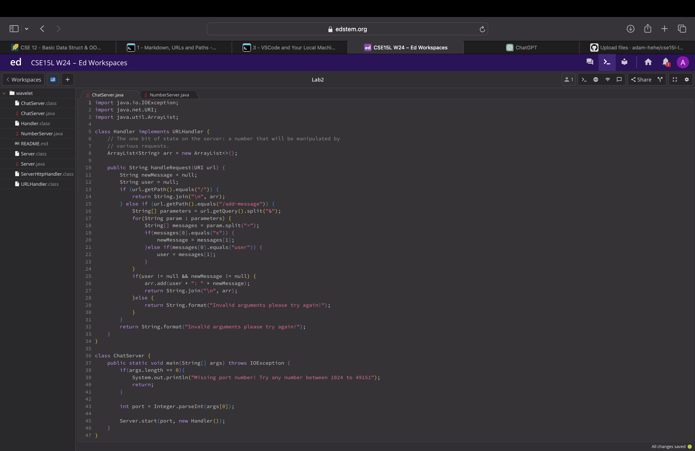
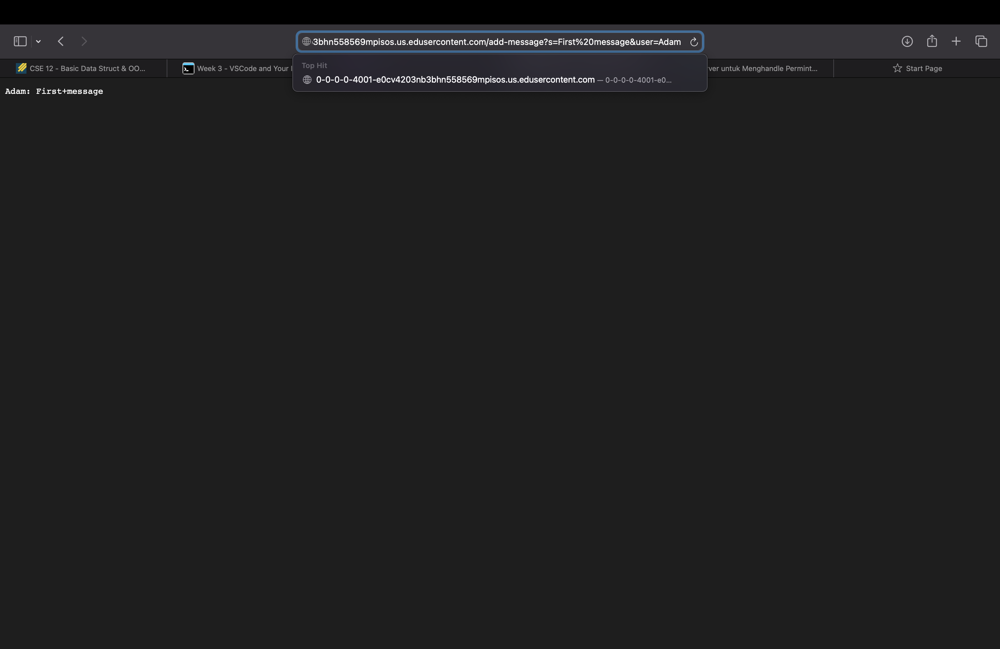
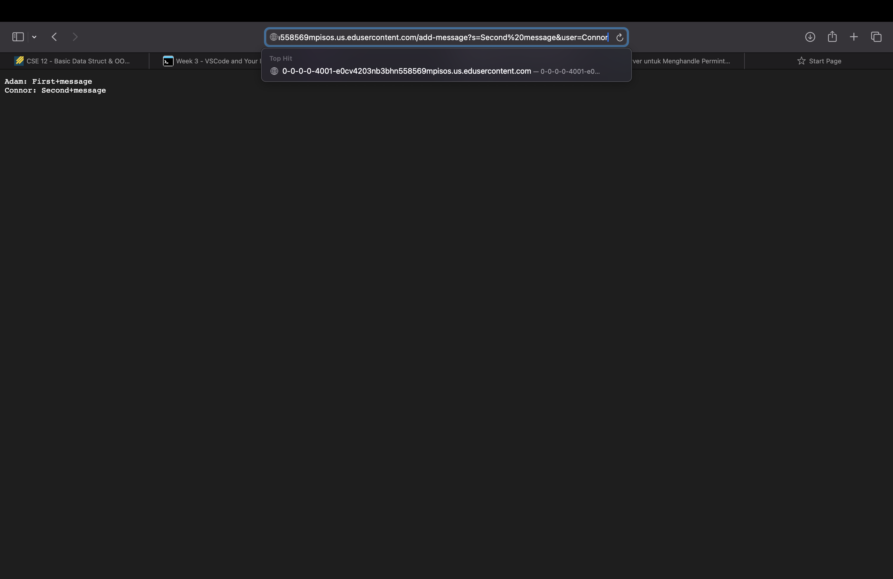
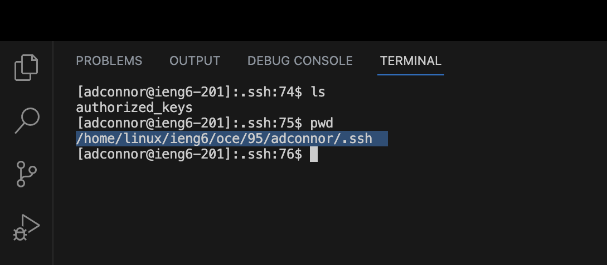
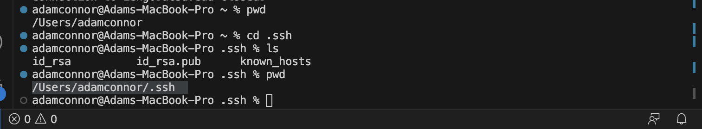
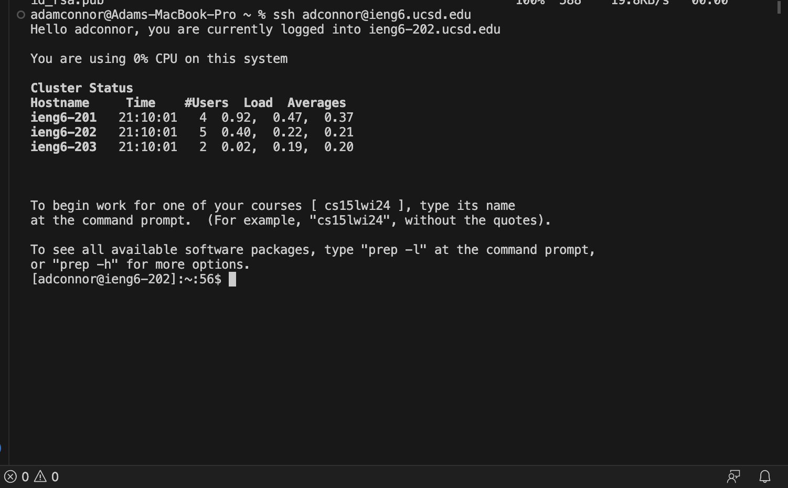

# Lab Report 2
## PART 1

**ChatServer Code**

**`/add-message` Example 1**

When this url is entered, the method `handleRequest(URL url)` is ran. The relevant argument to this method is the `url` that is entered in the search bar. The contents of `url` determine what values are stored in `user` and `newMessages`. These variables get stored into relevant field to the class is `arr`. The value of `arr` updates with each new `url` that is entered. 

**`/add-message` Example 2**

When this url is entered, the method `handleRequest(URL url)` is ran. The relevant argument to this method is the `url` that is entered in the search bar. This `url` differs from the previous expample and thus will output a different result. Now the values of `user` and `newMessages` are different and `arr` will get updated with these new values. Now two elements are stored in `arr` and they are presented on screen seperated by a `\n` character.

## PART 2
**`ls` showing Public key location**

Absolute path of public key: `/home/linux/ieng6/oce/95/adconnor/.ssh/authorized_keys`

**`ls` showing Private key location**

Absolute path of public key: `/home/linux/ieng6/oce/95/adconnor/.ssh/authorized_keys`

Absolute path of private key: `/Users/adamconnor/.ssh/id_rsa`

**Successful login with no password**

## PART 3
One thing I learned in lab recently is what the `ssh` command does and how it allows me to remotley connect to another computer on my same network. Another thing I learned how to create my own web server and how to write code that uses `URL url` as a parameter.
